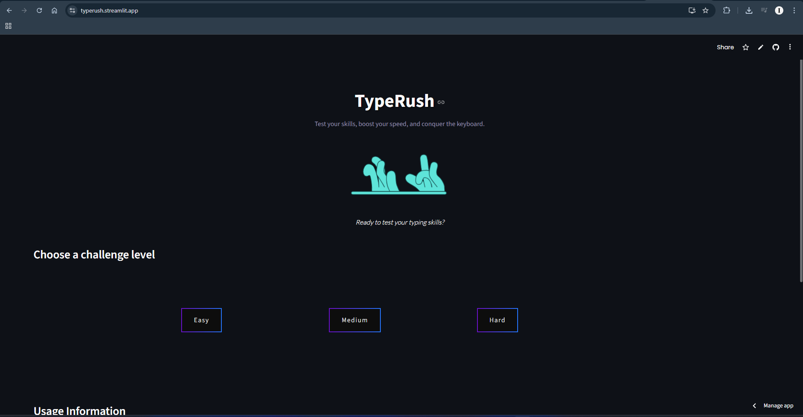
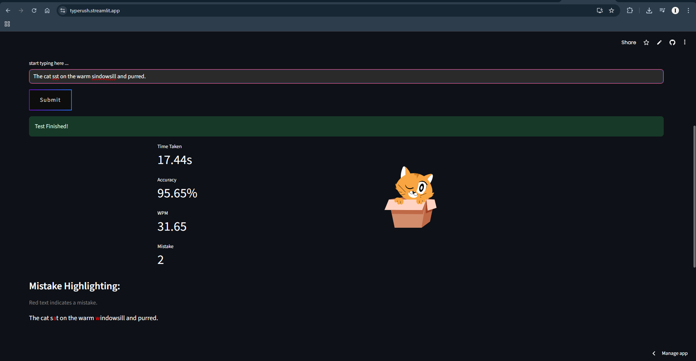

# TypeRush ⌨️🔥

**Think you're fast? Prove it.** TypeRush is a typing speed test that tracks your WPM, accuracy, and mistakes in real time — built with Streamlit, polished with Lottie animations.

---

## What it does ✨

- 🎯 **3 difficulty levels** — Easy, Medium, Hard, each with its own pool of passages
- ⏱️ **Live countdown** — a 3-2-1 countdown before every test starts
- 📊 **Instant results** — WPM, accuracy %, time taken, and mistake count the moment you submit
- 🔴 **Mistake highlighting** — see exactly which characters you got wrong, color-coded
- 🎬 **Lottie animations** — smooth, playful motion graphics instead of static screens
- 🔁 **Restart anytime** — jump back to difficulty selection with one click

## Tech stack 🛠️

| Layer | Tech |
|---|---|
| App framework | Streamlit |
| Animations | streamlit-lottie |
| Styling | Custom CSS |
| Logic | Pure Python (WPM, accuracy, mistake detection) |

## Running it locally 🚀

```bash
git clone https://github.com/zain-the-npc/TypeRush.git
cd TypeRush
pip install -r requirements.txt
streamlit run app.py
```

Pick a difficulty, type the passage shown, hit **Submit**, and see your stats.

## How scoring works 🧮

- **WPM** — typed characters ÷ 5, divided by elapsed time in minutes (the standard "average word length" convention)
- **Accuracy** — percentage of characters that match the original text at the same position, counting anything you didn't finish typing as a mistake
- **Mistakes** — total count of incorrect or missing characters

## Screenshots 📸



--




---

Designed and developed by Zain.
